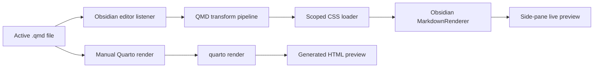

<div align="center">
  <h1>QMD Preview</h1>
  <h3>Edit Quarto Markdown in Obsidian with a side-pane live preview.</h3>

  <p>
    <a href="https://github.com/elliotxx/obsidian-qmd-preview/actions/workflows/release.yml"></a>
    <a href="LICENSE"></a>
    
    
  </p>

  <p>
    <a href="README.zh-CN.md">简体中文</a>
    ◆ <a href="#why-qmd-preview">Why QMD Preview?</a>
    ◆ <a href="#quick-start">Quick Start</a>
    ◆ <a href="#demo">Demo</a>
    ◆ <a href="#installation">Installation</a>
    ◆ <a href="#architecture">Architecture</a>
  </p>
</div>

QMD Preview is an Obsidian desktop plugin for editing `.qmd` files and previewing them in a side pane. It is built for people who write Quarto Markdown but want Obsidian's editing workflow, backlinks, vault navigation, and fast local feedback.

The live preview does not call Quarto or execute document code. It converts supported QMD and Pandoc syntax into Obsidian-renderable Markdown or HTML, then lets Obsidian render the result. When you need the final output, you can run an explicit `quarto render` from the preview pane.

## Latest News

- **[2026/06]** Added GitHub Release packaging with `manifest.json`, `main.js`, and `styles.css`.
- **[2026/06]** Added project-level release skill for repeatable maintainer releases.
- **[2026/06]** Initial QMD live preview with Quarto render fallback.

## Why QMD Preview?

- **Fast writing feedback**: keep a live preview open while editing `.qmd` files in Obsidian.
- **Clear safety boundary**: live preview never executes Python, R, Julia, shell, or other document code.
- **Useful QMD coverage**: preview common Quarto syntax such as code cells, callouts, Pandoc divs, figure captions, image attributes, and cross-reference placeholders.
- **Style-aware preview**: apply CSS referenced by the current QMD frontmatter or nearby `_metadata.yml` files.
- **Final output escape hatch**: run Quarto manually when you need to check official HTML output.

## Quick Start

### Install from GitHub Release assets

```bash
# 1. Create the plugin directory:
<VAULT_PATH>/.obsidian/plugins/qmd-preview/
# 2. Download manifest.json, main.js, and styles.css from the same GitHub Release.
# 3. Put the three files into the plugin directory.
```

The plugin directory should contain:

```text
manifest.json
main.js
styles.css
```

Then enable `QMD Preview` in Obsidian's Community plugins settings.

> **Prerequisites**: Obsidian desktop. Quarto CLI is optional and only needed for manual `Quarto 渲染`.

### Agent-assisted install

Send this prompt to a local coding agent and replace `<VAULT_PATH>` with your Obsidian vault path:

```text
Install the "QMD Preview" Obsidian plugin into this Vault: <VAULT_PATH>

Plugin information:
- Plugin ID: qmd-preview
- GitHub repository: git@github.com:elliotxx/obsidian-qmd-preview.git
- Target Obsidian vault: <VAULT_PATH>

Install steps:
- Clone or update the repository in the local workspace.
- Prefer the latest GitHub Release assets: manifest.json, main.js, and styles.css.
- If release assets are unavailable, run npm install && npm run package and use the locally generated release files.
- Copy manifest.json, main.js, and styles.css to <VAULT_PATH>/.obsidian/plugins/qmd-preview/.
- Check that manifest.json, main.js, and styles.css exist in the plugin directory.
- Confirm manifest.json has id qmd-preview and name QMD Preview.

Output:
- Repository path.
- Vault plugin directory.
- Current commit or local dirty state.
- Install status.
- Any manual Obsidian steps still needed.
```

## Demo

### Live preview flow

```qmd
---
title: Weekly Report
format:
  html:
    css: assets/report.css
---

# Progress {.weekly-title}

::: {.callout-note}
This block is shown as an Obsidian callout in live preview.
:::

{.evidence-image}

See @fig-dashboard for the full context.
```

QMD Preview turns the supported parts into an Obsidian-renderable preview:

- YAML frontmatter is not shown as document body.
- Quarto callouts become Obsidian callouts.
- Pandoc classes and attributes are preserved as HTML attributes where possible.
- Standalone images are rendered as figures with captions.
- Referenced CSS is scoped to the preview pane.

### Manual Quarto render

Use `Quarto 渲染` when the live preview is not enough. The plugin calls `quarto render`, displays the generated HTML, and keeps it separate from the live preview mode. Because Quarto may execute code, the first render asks for confirmation.

## Installation

### Manual installation

Download `manifest.json`, `main.js`, and `styles.css` from the same GitHub Release and copy them to:

```text
<VAULT_PATH>/.obsidian/plugins/qmd-preview/
```

### Development installation

```bash
git clone git@github.com:elliotxx/obsidian-qmd-preview.git
cd obsidian-qmd-preview
npm install
npm run build
npm run install-local -- --vault <VAULT_PATH>
```

### Quarto path

Manual Quarto rendering uses `quarto` by default. If Obsidian cannot find it, set the Quarto executable path in the plugin settings.

Common locations include:

```text
/usr/local/bin/quarto
/opt/homebrew/bin/quarto
/Applications/quarto/bin/quarto
```

If Quarto CLI is not installed, `Quarto 渲染` shows an install guide instead of a raw `spawn quarto ENOENT` error. Live preview still works without Quarto.

## Usage

1. Open a `.qmd` file in Obsidian.
2. Run the command `打开 QMD 预览` or click the ribbon icon.
3. Edit the QMD file; the side-pane preview updates automatically.
4. Use `实时预览` for writing feedback.
5. Use `Quarto 渲染` when you need to check official Quarto HTML output.

The plugin UI is currently Chinese. This README keeps the real command and button names so users can find them in Obsidian.

## Architecture



### Design decisions

- **Two preview modes**: live preview is fast and safe; Quarto render is slower but closer to final output.
- **No code execution in live preview**: QMD code cells are displayed, not run.
- **Scoped styles**: CSS from frontmatter and `_metadata.yml` is limited to the preview pane to avoid affecting the rest of Obsidian.
- **Desktop only**: local files, packaging, and Quarto CLI integration require desktop APIs.

## Limitations

The live preview is intentionally partial. It does not execute Python, R, Julia, shell, or other code cells. It does not fully implement bibliography processing, numbered cross references, Quarto filters, Quarto extensions, project-level `_quarto.yml` layout behavior, or every Pandoc attribute edge case.

Treat live preview as a fast editing view. Treat Quarto render as the final output check.

## Development

```bash
npm install
npm run lint
npm test
npm run package
```

Useful commands:

```bash
npm run dev
npm run build
npm run install-local -- --vault <VAULT_PATH>
npm run release:validate
```

Release artifacts are generated under `release/`:

```text
release/manifest.json
release/main.js
release/styles.css
release/qmd-preview-v{version}.zip
```

GitHub Releases publish only the three files used by Obsidian: `manifest.json`, `main.js`, and `styles.css`. The zip is a local and CI convenience artifact.

## Release

Maintainers can use the project skill at `.agents/skills/release-qmd-preview/SKILL.md`.

Manual release flow:

```bash
make version VERSION_TYPE=patch
npm run release:validate
npm run lint
npm test
npm run package
git tag {version}
git push origin {version}
```

Pushing the tag triggers the GitHub Actions release workflow.

## Contributing

Contributions are welcome. See [CONTRIBUTING.md](CONTRIBUTING.md).

Good first contribution areas:

- QMD transform coverage.
- Preview styling compatibility.
- Accessibility improvements.
- Documentation and examples.
- Tests for edge cases in `src/qmd.ts`.

Before opening a pull request, run:

```bash
npm run lint
npm test
npm run package
```

## Security

See [SECURITY.md](SECURITY.md).

The plugin does not store accounts, passwords, cookies, or tokens. Live preview does not execute QMD code. Manual Quarto render can execute document code and should only be used for documents you trust.

Manual Quarto render uses Node.js filesystem APIs to create temporary render output and uses `child_process` to run the local `quarto` executable. These capabilities are only used for explicit Quarto rendering, not for live preview.

## Acknowledgments

QMD Preview builds on [Obsidian](https://obsidian.md/) and [Quarto](https://quarto.org/). It aims to keep the writing loop fast while leaving final rendering authority to Quarto.

## License

This project is licensed under the [MIT License](LICENSE).
