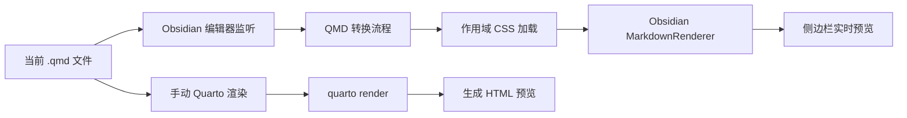

<div align="center">
  <h1>QMD Preview</h1>
  <h3>在 Obsidian 中编辑 Quarto Markdown，并在侧边栏实时预览。</h3>

  <p>
    <a href="https://github.com/elliotxx/obsidian-qmd-preview/actions/workflows/release.yml"></a>
    <a href="LICENSE"></a>
    
    
  </p>

  <p>
    <a href="README.md">English</a>
    ◆ <a href="#为什么选择-qmd-预览">为什么选择 QMD 预览？</a>
    ◆ <a href="#快速开始">快速开始</a>
    ◆ <a href="#演示">演示</a>
    ◆ <a href="#安装">安装</a>
    ◆ <a href="#架构">架构</a>
  </p>
</div>

QMD 预览是一个 Obsidian 桌面插件，用于在 Obsidian 中编辑 `.qmd` 文件，并在侧边栏实时预览。它适合已经使用 Quarto Markdown，同时又希望保留 Obsidian 编辑体验、双链、vault 导航和本地快速反馈的人。

实时预览不会调用 Quarto，也不会执行文档代码。插件会把支持的 QMD 和 Pandoc 语法转换成 Obsidian 可渲染的 Markdown 或 HTML，再交给 Obsidian 渲染。需要确认最终效果时，可以在预览栏中手动执行 `quarto render`。

## 最新进展

- **[2026/06]** 增加 GitHub Release 打包流程，发布 `manifest.json`、`main.js` 和 `styles.css`。
- **[2026/06]** 增加项目级发版 skill，维护者后续可以按固定流程发版。
- **[2026/06]** 初始化 QMD 实时预览和 Quarto 渲染兜底能力。

## 为什么选择 QMD 预览？

- **快速写作反馈**：编辑 `.qmd` 文件时，可以在侧边栏持续查看预览。
- **安全边界清晰**：实时预览不执行 Python、R、Julia、shell 或其他文档代码。
- **覆盖常用 QMD 语法**：支持代码单元格、callout、Pandoc div、图片题注、图片属性和交叉引用占位。
- **能使用自定义样式**：读取当前 QMD frontmatter 或上级 `_metadata.yml` 中引用的 CSS，并应用到预览栏。
- **保留最终渲染入口**：需要确认官方 HTML 输出时，可以手动调用 Quarto 渲染。

## 快速开始

### 使用 GitHub Release 资产安装

```bash
# 1. 创建插件目录：
<VAULT_PATH>/.obsidian/plugins/qmd-preview/
# 2. 从同一个 GitHub Release 下载 manifest.json、main.js 和 styles.css。
# 3. 将这三个文件放入插件目录。
```

插件目录中应包含：

```text
manifest.json
main.js
styles.css
```

然后在 Obsidian 的第三方插件设置中启用 `QMD Preview`。

> **环境要求**：Obsidian 桌面版。Quarto CLI 是可选项，只在手动使用“Quarto 渲染”时需要。

### Agent 安装

把下面的 Prompt 发给本机 Agent，并替换 `<VAULT_PATH>`：

```text
将 “QMD Preview” Obsidian 插件安装到这个 Vault：<VAULT_PATH>

插件信息：
- 插件 ID：qmd-preview
- GitHub 仓库：git@github.com:elliotxx/obsidian-qmd-preview.git
- 目标 Obsidian vault：<VAULT_PATH>

安装动作：
- clone 或更新仓库到本机工作区。
- 优先使用 GitHub Releases 中的最新 `manifest.json`、`main.js` 和 `styles.css`。
- 如果 Release 资产不可用，再执行 npm install && npm run package，使用本地生成的 release 文件。
- 将 `manifest.json`、`main.js` 和 `styles.css` 复制到 <VAULT_PATH>/.obsidian/plugins/qmd-preview/。
- 检查插件目录中存在 manifest.json、main.js、styles.css。
- 确认 manifest.json 中 id 是 qmd-preview，name 是 QMD Preview。

输出：
- 仓库路径。
- vault 插件目录。
- 当前 commit 或本地未提交状态。
- 安装状态。
- 需要手动完成的 Obsidian 操作。
```

## 演示

### 实时预览流程

```qmd
---
title: Weekly Report
format:
  html:
    css: assets/report.css
---

# Progress {.weekly-title}

::: {.callout-note}
This block is shown as an Obsidian callout in live preview.
:::

{.evidence-image}

See @fig-dashboard for the full context.
```

QMD 预览会把支持的部分转换成 Obsidian 可渲染的预览：

- YAML frontmatter 不作为正文展示。
- Quarto callout 转成 Obsidian callout。
- Pandoc class 和属性尽量保留为 HTML 属性。
- 独立图片渲染为带题注的 figure。
- 引用的 CSS 会限定在预览栏作用域内。

### 手动 Quarto 渲染

当实时预览不足以判断最终效果时，使用“Quarto 渲染”。插件会调用 `quarto render`，展示生成的 HTML，并与实时预览模式分开。由于 Quarto 可能执行代码，首次渲染前会要求确认。

## 安装

### 手动安装

从同一个 GitHub Release 下载 `manifest.json`、`main.js` 和 `styles.css`，并复制到：

```text
<VAULT_PATH>/.obsidian/plugins/qmd-preview/
```

### 开发安装

```bash
git clone git@github.com:elliotxx/obsidian-qmd-preview.git
cd obsidian-qmd-preview
npm install
npm run build
npm run install-local -- --vault <VAULT_PATH>
```

### Quarto 路径

手动 Quarto 渲染默认使用 `quarto`。如果 Obsidian 找不到可执行文件，可以在插件设置中填写 Quarto 路径。

常见路径：

```text
/usr/local/bin/quarto
/opt/homebrew/bin/quarto
/Applications/quarto/bin/quarto
```

## 使用

1. 在 Obsidian 中打开 `.qmd` 文件。
2. 执行命令“打开 QMD 预览”，或点击左侧 ribbon 图标。
3. 编辑 QMD 文件，侧边栏预览会自动更新。
4. 写作时使用“实时预览”。
5. 需要确认 Quarto 官方 HTML 输出时，点击“Quarto 渲染”。

## 架构



### 设计取舍

- **两种预览模式**：实时预览快且安全；Quarto 渲染更接近最终输出。
- **实时预览不执行代码**：QMD 代码单元格只展示，不运行。
- **样式作用域隔离**：frontmatter 和 `_metadata.yml` 中引用的 CSS 只作用于预览栏。
- **只支持桌面端**：本地文件、打包和 Quarto CLI 集成都依赖桌面 API。

## 边界

实时预览是有意做成部分支持。它不执行 Python、R、Julia、shell 或其他代码单元格，也不完整实现 bibliography、自动编号交叉引用、Quarto filters、Quarto extensions、项目级 `_quarto.yml` 布局行为和所有 Pandoc 属性边界情况。

实时预览适合快速写作反馈。最终效果以 Quarto 渲染为准。

## 开发

```bash
npm install
npm run lint
npm test
npm run package
```

常用命令：

```bash
npm run dev
npm run build
npm run install-local -- --vault <VAULT_PATH>
npm run release:validate
```

发布产物生成在 `release/`：

```text
release/manifest.json
release/main.js
release/styles.css
release/qmd-preview-v{version}.zip
```

GitHub Release 只发布 Obsidian 会下载的三个文件：`manifest.json`、`main.js` 和 `styles.css`。zip 只作为本地和 CI 便利产物。

## 发版

维护者可以使用项目级 skill：`.agents/skills/release-qmd-preview/SKILL.md`。

手动发版流程：

```bash
make version VERSION_TYPE=patch
npm run release:validate
npm run lint
npm test
npm run package
git tag {version}
git push origin {version}
```

推送 tag 后，GitHub Actions 会创建 Release。

## 贡献

欢迎贡献。见 [CONTRIBUTING.md](CONTRIBUTING.md)。

适合优先改进的方向：

- QMD 转换覆盖范围。
- 预览样式兼容性。
- 可访问性优化。
- 文档和示例。
- `src/qmd.ts` 边界场景测试。

提交 PR 前请运行：

```bash
npm run lint
npm test
npm run package
```

## 安全

见 [SECURITY.md](SECURITY.md)。

插件不保存账号、密码、Cookie 或 token。实时预览不执行 QMD 代码。手动 Quarto 渲染可能执行文档代码，只应对可信文档使用。

手动 Quarto 渲染会使用 Node.js 文件系统 API 创建临时渲染输出，并通过 `child_process` 调用本机 `quarto` 可执行文件。这些能力只用于用户显式触发的 Quarto 渲染，不用于实时预览。

## 致谢

QMD 预览基于 [Obsidian](https://obsidian.md/) 和 [Quarto](https://quarto.org/) 构建。它的目标是让写作反馈更快，同时把最终渲染权威保留给 Quarto。

## 许可证

本项目使用 [MIT License](LICENSE)。
